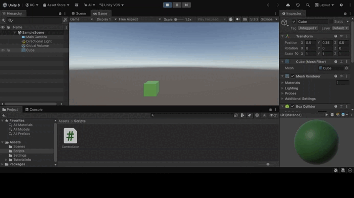
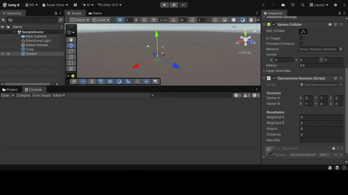
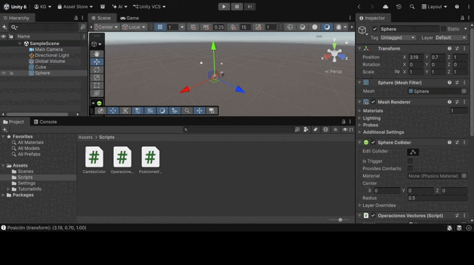
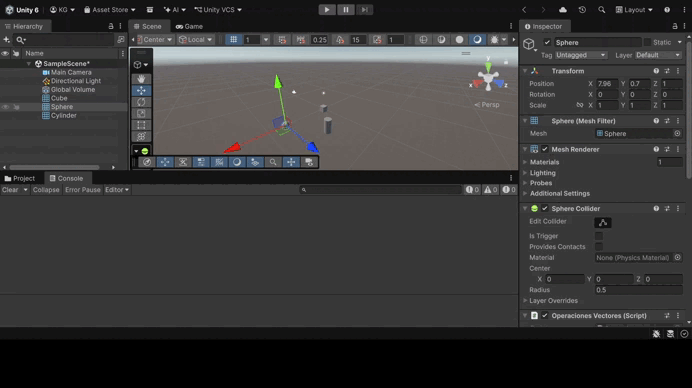

# Práctica 1 de Unity: Introducción a scripts en C#

En esta práctica se desarrollan los ejercicios 1 a 4 de introducción a la programación de scripts en Unity. Se trabaja con componentes de los GameObjects (`Renderer`, `Transform`), con la clase `Vector3` y sus utilidades, con la clase `Random` y con la búsqueda de objetos por etiqueta. Cada ejercicio incluye un GIF con la prueba de ejecución y el enlace a su script.

---

## Ejercicio 1: Cambio de color aleatorio

Se inicializa un vector de 3 posiciones con valores entre 0.0 y 1.0, que se usa como color RGB del objeto. Cada cierto número de frames (120 por defecto, configurable desde el Inspector) se cambia el valor de una posición aleatoria y se asigna el nuevo color.

📄 Script: [CambioColor.cs](Scripts/CambioColor.cs)

---

## Ejercicio 2: Operaciones con vectores

La esfera tiene dos variables `Vector3` públicas editables desde el Inspector. Se muestran en la consola y en el Inspector la magnitud de cada vector, el ángulo que forman, la distancia entre ellos y cuál está a mayor altura.

📄 Script: [Operacionesvectores.cs](Scripts/Operacionesvectores.cs)

---

## Ejercicio 3: Posición de la esfera

Se muestra la posición de la esfera accediendo a su componente `Transform`, tanto con `GetComponent<Transform>()` como con la propiedad `transform`. La posición aparece en la consola, en el Inspector y sobre la vista Game.

📄 Script: [Posicionesfera.cs](Scripts/Posicionesfera.cs)

---

## Ejercicio 4: Distancia al cubo y al cilindro

La esfera localiza el cubo y el cilindro mediante sus etiquetas con `GameObject.FindWithTag` y calcula la distancia a cada uno con `Vector3.Distance`. Las distancias se muestran en la consola cada vez que cambia la posición de alguno de los objetos.

📄 Script: [Distanciaobjetos.cs](Scripts/Distanciaobjetos.cs)